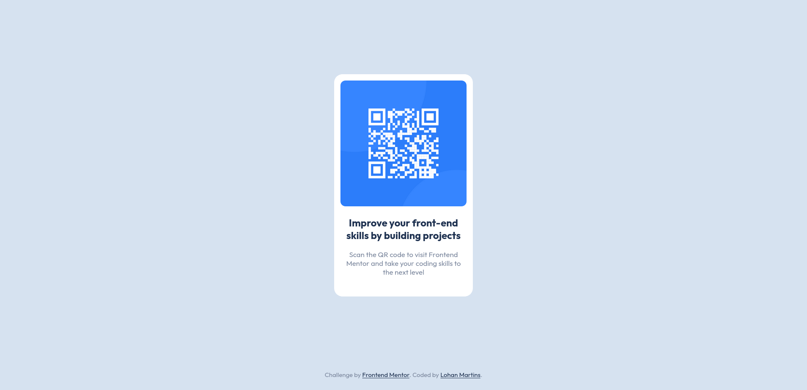

# Frontend Mentor - Solução do componente de código QR

Esta é uma solução para o [desafio do componente de código QR no Frontend Mentor](https://www.frontendmentor.io/challenges/qr-code-component-iux_sIO_H).

## Sumário

-   [Captura de tela](#captura-de-tela)
-   [Links](#links)
-   [Tecnologias Utilizadas](#tecnologias-utilizadas)
-   [Aprendizado](#aprendizado)
-   [Autor](#autor)


### Captura de tela



### Links

-   URL da solução: [Adicione a URL da solução aqui](https://sua-url-de-solução.com)
-   URL do site ao vivo: [Adicione a URL do site ao vivo aqui](https://lohan-martins.github.io/desafio-qrcode-frontend-mentor/)


### Tecnologias Utilizadas

-   HTML5
-   CSS


### Aprendizado

Durante o desafio, aprimorei minhas habilidades em HTML semântico e Flexbox, o que me permitiu criar layouts mais acessíveis e flexíveis. Além disso, adquiri conhecimentos adicionais sobre Git e GitHub, melhorando minha capacidade de versionamento e colaboração em projetos de desenvolvimento.


```html
<footer>
    <div class="attribution">
        Challenge by <a href="https://www.frontendmentor.io?ref=challenge" target="_blank">Frontend Mentor</a>.
        Coded by <a href="https://www.frontendmentor.io/profile/Lohan-Martins">Lohan Martins</a>.
    </div>
</footer>
```
- Adicionei um rodapé à página do desafio, algo que não estava presente no design original do projeto.


## Autor

-   Linkedin - [Lohan Martins](https://www.linkedin.com/in/lohan-martins-798297217/)
-   Frontend Mentor - [@Lohan-Martins](https://www.frontendmentor.io/profile/Lohan-Martins)


